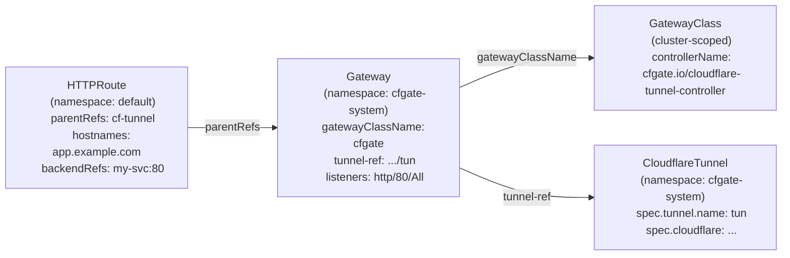

# Gateway API Primer

## Coming from Ingress?

Gateway API is the Kubernetes successor to Ingress, providing a role-oriented, portable, and expressive API for service networking. If you are migrating from an Ingress-based Cloudflare operator (such as [STRRL/cloudflare-tunnel-ingress-controller](https://github.com/STRRL/cloudflare-tunnel-ingress-controller) or [adyanth/cloudflare-operator](https://github.com/adyanth/cloudflare-operator)), this page explains the key concepts you need to understand.

Gateway API separates concerns by role: infrastructure providers define GatewayClasses, cluster operators create Gateways, and application developers attach Routes. This maps cleanly to cfgate's architecture.

## Key Concepts

### GatewayClass

A GatewayClass defines which controller handles a class of Gateways. It is a cluster-scoped resource (not namespaced).

cfgate registers the controller name `cfgate.io/cloudflare-tunnel-controller`. You create a GatewayClass that references this controller name, and cfgate will handle all Gateways bound to that class.

Think of GatewayClass as the "driver": it tells Kubernetes which software manages Gateways of this type.

```yaml
apiVersion: gateway.networking.k8s.io/v1
kind: GatewayClass
metadata:
  name: cfgate
spec:
  controllerName: cfgate.io/cloudflare-tunnel-controller
```

You only need one GatewayClass for cfgate. The controller accepts it automatically when `spec.controllerName` matches.

### Gateway

A Gateway is a runtime instance bound to a GatewayClass. In cfgate, a Gateway represents a Cloudflare Tunnel endpoint.

The `cfgate.io/tunnel-ref` annotation connects the Gateway to a CloudflareTunnel resource. The GatewayClass tells Kubernetes that cfgate manages this Gateway; the Gateway itself is the runtime binding between the tunnel and the routes.

```yaml
apiVersion: gateway.networking.k8s.io/v1
kind: Gateway
metadata:
  name: cloudflare-tunnel
  namespace: cfgate-system
  annotations:
    cfgate.io/tunnel-ref: cfgate-system/my-tunnel
spec:
  gatewayClassName: cfgate
  listeners:
    - name: http
      protocol: HTTP
      port: 80
      allowedRoutes:
        namespaces:
          from: All
```

Key points:
- `gatewayClassName: cfgate` binds this Gateway to the cfgate GatewayClass
- `cfgate.io/tunnel-ref` links to the CloudflareTunnel that provides the actual tunnel
- `allowedRoutes.namespaces.from: All` permits routes from any namespace to attach (default is `Same`, which restricts to the Gateway's namespace)
- The `port` and `protocol` fields satisfy the Gateway API spec but do not determine what cloudflared actually serves. Cloudflared routing is driven by the routes themselves

### Routes (HTTPRoute)

Routes attach to Gateways via `parentRefs` and define routing rules. In cfgate, each route becomes one or more cloudflared ingress rules.

Current route support is **HTTPRoute** only.

```yaml
apiVersion: gateway.networking.k8s.io/v1
kind: HTTPRoute
metadata:
  name: my-app
  namespace: default
spec:
  parentRefs:
    - name: cloudflare-tunnel
      namespace: cfgate-system
  hostnames:
    - app.example.com
  rules:
    - backendRefs:
        - name: my-service
          port: 80
```

This creates a cloudflared ingress rule: `app.example.com` routes to `http://my-service.default.svc.cluster.local:80`.

Per-route behavior is configured via annotations on the Route resource. See [Annotations Reference](annotations.md) for the full list.

### What Actually Gets Published To Cloudflare

Gateway and HTTPRoute status are part of the publishing contract. cfgate emits Cloudflare Tunnel ingress rules only for routes accepted by Gateway API attachment rules.

A route does not publish to Cloudflare when:

- Its parentRef does not target a cfgate-managed Gateway.
- Its sectionName does not match the selected listener.
- Its hostname is not accepted by the listener hostname.
- `allowedRoutes.namespaces.from: Same` is set and the route is outside the Gateway namespace.
- `allowedRoutes.namespaces.from: Selector` is set and the route namespace labels do not match.
- A backend Service reference crosses namespaces without a `ReferenceGrant` in the backend namespace.

Rejected routes are skipped during Cloudflare config sync. Valid sibling routes can still publish.

### Backend TLS and Origin Policy

Use Gateway API `BackendTLSPolicy` for portable backend TLS validation when the policy targets a backend `Service`. cfgate maps valid CA bundles to managed cloudflared `originRequest.caPool` paths.

Use [CloudflareOriginPolicy](cloudflare-origin-policy.md) for cfgate-specific cloudflared origin settings such as host header overrides, connection timeouts, HTTP/2 origin mode, h2c origin mode, and named CA pools.

When both apply to the same backend, cfgate starts with tunnel defaults, applies `CloudflareOriginPolicy`, then applies `BackendTLSPolicy`, then applies route annotations as the final alpha-line override. This lets you migrate annotations to policies without changing behavior until the annotations are removed.

### Origin Runtime Composition

Origin settings are composed in this order:

1. `CloudflareTunnel.spec.originDefaults`
2. `CloudflareOriginPolicy`
3. `BackendTLSPolicy`
4. HTTPRoute annotations

BackendTLSPolicy can change the generated origin service scheme to HTTPS. That conflicts with h2c because h2c is cleartext HTTP/2 and requires HTTP origin protocol. Route annotations can override only compatible origin settings and cannot change a BackendTLSPolicy backend back to HTTP.

`GRPCRoute`, `TCPRoute`, and `TLSRoute` are not current public-hostname route surfaces for cfgate. Cloudflare Tunnel public hostnames are HTTP-family published applications; gRPC through Tunnel is documented for private subnet routing, and non-HTTP public services require client-side cloudflared or private routing.

## How cfgate Uses Gateway API

The full chain from infrastructure to application routing:



1. **GatewayClass** tells Kubernetes that cfgate handles Gateways with `controllerName: cfgate.io/cloudflare-tunnel-controller`.
2. **Gateway** creates the tunnel binding via the `cfgate.io/tunnel-ref` annotation. The controller sets the Gateway status to `Programmed` when the tunnel is ready.
3. **Routes** define which hostnames and paths map to which backend services. cfgate collects routes attached to Gateways it manages and pushes them as cloudflared ingress rules.
4. **CloudflareDNS** (optional) watches routes and creates CNAME records pointing hostnames to the tunnel domain.

## The cfgate-system Namespace

cfgate installs into `cfgate-system` by default:
- **Helm:** `--namespace cfgate-system --create-namespace` creates it automatically
- **Kustomize:** The `install.yaml` manifest includes the namespace definition

CloudflareTunnel and CloudflareDNS resources typically live in `cfgate-system` alongside the controller. Routes and the services they reference can be in any namespace.

To allow routes from other namespaces to attach to a Gateway in `cfgate-system`, set `allowedRoutes.namespaces.from: All` on the Gateway listener:

```yaml
spec:
  listeners:
    - name: http
      protocol: HTTP
      port: 80
      allowedRoutes:
        namespaces:
          from: All      # Routes from any namespace can attach
```

Without this, only routes in the same namespace as the Gateway can attach. You can also use `Selector` with label selectors for finer control.

## Comparison with Ingress

| Concept | Ingress | Gateway API (cfgate) |
|---|---|---|
| Controller selection | IngressClass | GatewayClass |
| Runtime instance | Implicit (Ingress resources create it) | Explicit Gateway resource |
| Routing rules | Ingress resource (host + path rules) | HTTPRoute |
| Per-route config | Annotations on Ingress | Annotations on Route |
| Multi-tenancy | Namespace isolation only | Gateway `allowedRoutes` with namespace selectors |
| Protocol support | HTTP/HTTPS only | HTTPRoute-driven HTTP routing |
| Role separation | None (one resource does everything) | GatewayClass (infra), Gateway (ops), Route (dev) |
| Cross-namespace routing | Not supported | Built-in via `parentRefs` with namespace |

### Migration Notes

If you are migrating from an Ingress-based Cloudflare operator:

1. **Create a GatewayClass and Gateway.** These replace the implicit infrastructure that Ingress-based operators manage behind the scenes.
2. **Convert Ingress resources to HTTPRoutes.** Each Ingress host/path rule becomes an HTTPRoute. The `parentRefs` field replaces the IngressClass binding.
3. **Move annotations.** Ingress annotations on the Ingress resource move to per-route annotations on HTTPRoute resources. Annotation names may differ; see [Annotations Reference](annotations.md).
4. **Set up CloudflareDNS.** Ingress operators often handle DNS automatically. With cfgate, DNS management is a separate CRD (CloudflareDNS) that you configure explicitly.

## Further Reading

- [Gateway API documentation](https://gateway-api.sigs.k8s.io/)
- [CloudflareTunnel Reference](cloudflare-tunnel.md)
- [CloudflareDNS Reference](cloudflare-dns.md)
- [CloudflareAccessPolicy Reference](cloudflare-access-policy.md)
- [CloudflareAccessApplication Reference](cloudflare-access-application.md)
- [CloudflareOriginPolicy Reference](cloudflare-origin-policy.md)
- [Annotations Reference](annotations.md)
- [Troubleshooting](troubleshooting.md)
- [Service Mesh Integration](service-mesh.md)
