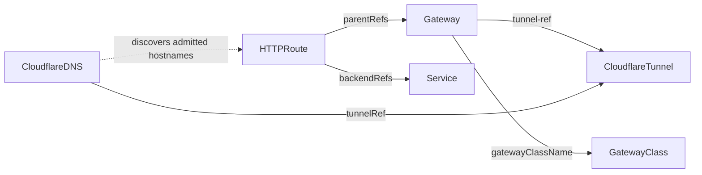

# Gateway API Primer

cfgate uses Gateway API resources to attach HTTPRoutes to Cloudflare Tunnels and translate their host/path matches into cloudflared ingress rules.

For installation and an end-to-end example, start with [Getting started](getting-started.md). This page explains the resource model and the routing behavior cfgate supports.

## Key Concepts

| Resource | Scope | Role in cfgate |
|---|---|---|
| `GatewayClass` | Cluster | Selects the cfgate controller. |
| `Gateway` | Namespace | Binds listeners and route permissions to a CloudflareTunnel. |
| `HTTPRoute` | Namespace | Maps hostnames and paths to Kubernetes Service backends. |
| `CloudflareTunnel` | Namespace | Manages the remote tunnel and connector Deployment. |
| `CloudflareDNS` | Namespace | Optionally discovers admitted route hostnames and publishes DNS. |
| `CloudflareAccessApplication` | Namespace | Binds Gateway or HTTPRoute targets to reusable Access policies. |

### GatewayClass

A GatewayClass selects cfgate with `controllerName: cfgate.io/cloudflare-tunnel-controller`. One class is sufficient for Gateways handled by this controller:

```yaml
apiVersion: gateway.networking.k8s.io/v1
kind: GatewayClass
metadata:
  name: cfgate
spec:
  controllerName: cfgate.io/cloudflare-tunnel-controller
```

### Gateway

A Gateway selects that class and names its tunnel through `cfgate.io/tunnel-ref`. The following Gateway permits HTTPRoutes from any namespace; replace `All` with `Same` or a namespace `Selector` to restrict attachment:

```yaml
apiVersion: gateway.networking.k8s.io/v1
kind: Gateway
metadata:
  name: cloudflare-tunnel
  namespace: cfgate-system
  annotations:
    cfgate.io/tunnel-ref: cfgate-system/my-tunnel
spec:
  gatewayClassName: cfgate
  listeners:
    - name: http
      protocol: HTTP
      port: 80
      allowedRoutes:
        namespaces:
          from: All
```

Listener fields participate in attachment and hostname validation. They do not create a Kubernetes load-balancer Service or select origin transport. Backend URLs come from route Service references and [origin annotations](annotations.md).

### Routes (HTTPRoute)

cfgate supports HTTPRoute. A route attaches through `parentRefs`, subject to the selected Gateway listener's `allowedRoutes`. This example forwards an admitted hostname to `http://my-service.default.svc.cluster.local:80`, assuming the Service exists and exposes TCP port 80:

```yaml
apiVersion: gateway.networking.k8s.io/v1
kind: HTTPRoute
metadata:
  name: my-app
  namespace: default
spec:
  parentRefs:
    - name: cloudflare-tunnel
      namespace: cfgate-system
  hostnames:
    - app.example.com
  rules:
    - backendRefs:
        - name: my-service
          port: 80
```

The controller's `--cluster-domain` setting changes the generated Service DNS suffix. DNS publication requires a separate CloudflareDNS resource, and Access protection requires a CloudflareAccessApplication.

## How cfgate Uses Gateway API


```mermaid
flowchart LR
    HR[HTTPRoute] -->|parentRefs| GW[Gateway]
    GW -->|gatewayClassName| GC[GatewayClass]
    GW -->|tunnel-ref| CT[CloudflareTunnel]
    HR -->|backendRefs| SVC[Service]
    DNS[CloudflareDNS] -->|tunnelRef| CT
    DNS -.->|discovers admitted hostnames| HR
```

cfgate verifies GatewayClass ownership, the tunnel binding, listener permissions, and route references before publishing ingress. Gateway `Programmed` reports tunnel readiness. Route status exposes admission and backend-reference failures; it is not itself authorization for later reconciliations.

## The cfgate-system Namespace

Installation examples use `cfgate-system` for the controller and infrastructure resources. HTTPRoutes and backend Services may live in other namespaces. Gateway listeners default to same-namespace routes; use `allowedRoutes.namespaces.from: All` or `Selector` for other namespaces.

Route attachment uses `allowedRoutes`. Cross-namespace Service backends, Gateway-to-Tunnel bindings, credentials, and Access references require the relevant ReferenceGrants. Namespace reachability alone is not permission. See [authorization and ownership](authorization-and-ownership.md) for grant examples.

## Supported HTTPRoute behavior

cfgate tunnel ingress supports one Kubernetes Service backend per rule, hostname matching, and omitted, `Exact`, `PathPrefix`, or Go-compatible `RegularExpression` path matches. Any positive weight for the single backend receives all matching traffic. A zero-weight backend receives no traffic; cfgate emits an HTTP 500 response for its match so requests cannot fall through to a broader rule. A rule without a backend also returns HTTP 500. Multiple backend references cannot be forwarded because weighted distribution is not implemented; their matches return HTTP 500.

Method, header, and query matches, rule or backend filters, request timeouts, retries, and session persistence are unsupported. A route using any of these fields receives `Accepted=False` with reason `UnsupportedValue` and contributes no forwarding rules. cfgate does not silently drop a restriction. Other valid HTTPRoutes remain active. Missing, unauthorized, or unsupported backend references set `ResolvedRefs=False`. Their specific matches return HTTP 500, while valid sibling rules remain active. This prevents invalid matches from falling through to a broader forwarding route. Only the canonical empty API group denotes a core Service; the literal group `core` is unsupported. A missing port defaults to 80 only when the Service actually exposes port 80.

Routes are evaluated by current GatewayClass ownership, listener permissions, namespace selectors, hostname intersection, and cross-namespace backend ReferenceGrants. Existing status is not used as authorization. A transient Kubernetes read failure aborts configuration synchronization rather than publishing a partially resolved configuration.

More specific hostnames precede overlapping wildcard hostnames. Within a hostname, exact paths precede regular expressions, followed by prefixes with the longest source path first. Regular-expression precedence is implementation-defined: longer expressions precede shorter expressions. Equal matches use the oldest route creation timestamp, then lexical `namespace/name`, then the first matching rule. Regular expressions remain active ahead of a catch-all prefix. For prefixes, trailing slashes are ignored: `/foo` and `/foo/` both match `/foo` and `/foo/bar`, but not `/foobar`. Exact paths retain trailing-slash significance. Configuration hashing preserves this ordered evaluation.

## Access protection

An HTTPRoute remains independent of Access readiness unless it sets `cfgate.io/access-required: namespace/name`. That dependency names a CloudflareAccessApplication and controls whether protected traffic may forward. See [Access-required routing](access-required.md) for the supported target subset and asynchronous withdrawal limits.

Origin transport failures and incompatible h2c connectors retain matching HTTP 503 responses. Configuration or Access dependency overload replaces the whole tunnel configuration with HTTP 503, including any custom fallback. [CloudflareTunnel](cloudflare-tunnel.md#configuration-overload) describes recovery.

## Comparison with Ingress

| Concern | Ingress | Gateway API in cfgate |
|---|---|---|
| Controller selection | IngressClass | GatewayClass |
| Infrastructure binding | Controller-specific | Gateway with tunnel annotation |
| Host/path rules | Ingress | HTTPRoute |
| Per-route options | Controller-specific annotations | cfgate HTTPRoute annotations |
| Route attachment permissions | Controller-specific | Listener `allowedRoutes` |
| Backend references across namespaces | Controller-specific extensions | ReferenceGrant-authorized Service references |
| DNS and Access | Controller-specific | Separate cfgate resources |

### Migration Notes

Create the GatewayClass and Gateway, then translate each Ingress host/path rule into an HTTPRoute with an appropriate `parentRefs` entry. Check the supported features above before translating filters or multiple backends. Move only annotations with a documented cfgate equivalent.

Configure CloudflareDNS separately for hostname publication and CloudflareAccessApplication for protection. Existing remote tunnels and records need explicit ownership migration; creating Kubernetes resources with matching names is insufficient. Follow [authorization and ownership](authorization-and-ownership.md) before switching controllers.

## Further Reading

- [CloudflareTunnel reference](cloudflare-tunnel.md)
- [CloudflareDNS reference](cloudflare-dns.md)
- [Access application reference](cloudflare-access-application.md)
- [Access policy reference](cloudflare-access-policy.md)
- [Annotations reference](annotations.md)
- [Troubleshooting](troubleshooting.md)
- [Service mesh integration](service-mesh.md)
- [Gateway API documentation](https://gateway-api.sigs.k8s.io/)
