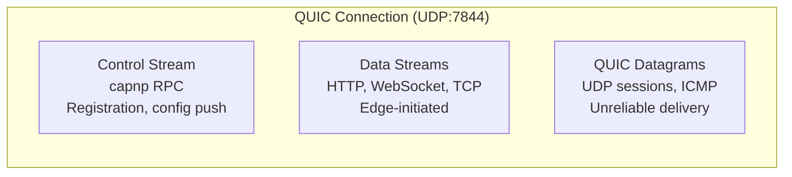
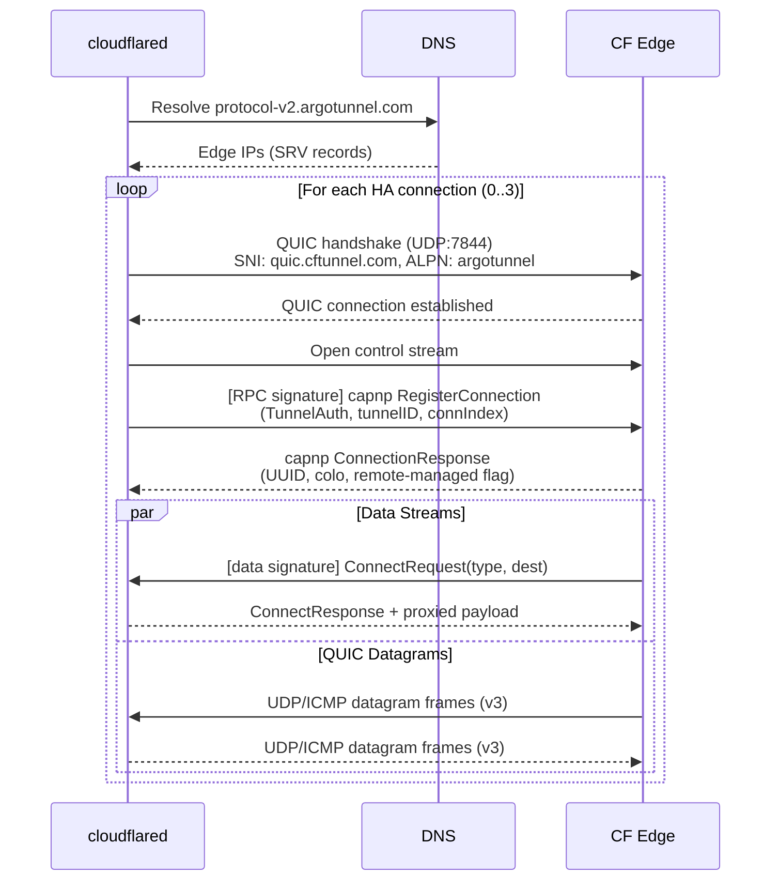
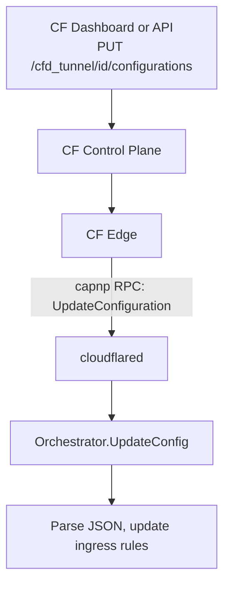
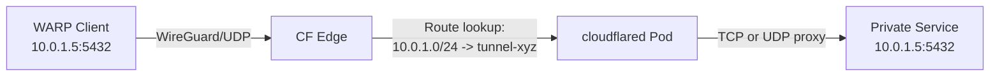

# cfgate v0.2.0 Protocol and Product Analysis

Technical reference for the networking protocols and Cloudflare products that inform cfgate v0.2.0 design decisions.

## cloudflared Transport Architecture

cloudflared uses **quic-go** (Go QUIC implementation) for tunnel transport and **Cap'n Proto** (capnp) for control plane RPC. It does not use quiche (Cloudflare's Rust QUIC library; separate project, different codebase).

### Connection Model

cloudflared opens up to 4 high-availability connections to different Cloudflare edge servers. Each connection follows this sequence:

1. DNS resolution of `protocol-v2.argotunnel.com` returns edge server IPs
2. `DialQuic()` creates a UDP socket bound to a specific local port per connection index
3. TLS handshake uses SNI `quic.cftunnel.com` with ALPN `argotunnel`
4. On success, cloudflared wraps the `quic.Connection` to ensure the UDP socket closes with the QUIC connection

Source: `cloudflared/connection/quic.go:21-89`

### Stream Multiplexing

Each QUIC connection carries three types of traffic:



- **Control stream**: First QUIC stream, opened by cloudflared. Carries tunnel registration (`RegisterConnection`) and configuration updates (`UpdateConfiguration`) via capnp RPC.
- **Data streams**: Opened by the edge toward cloudflared. Each starts with a 6-byte protocol signature (`0x0A36CD12A13E` for data, `0x52BB825CDB65` for RPC) followed by a capnp `ConnectRequest`.
- **QUIC datagrams**: RFC 9221 unreliable delivery. Used for UDP session payloads, ICMP packets, and UDP session registration (v3 protocol).

Source: `cloudflared/connection/quic_connection.go:87-143`

### Protocol Selection

| Mode | Flag | Behavior |
|------|------|----------|
| auto | `--protocol auto` (default) | QUIC with HTTP/2 fallback |
| quic | `--protocol quic` | Force QUIC; required for post-quantum |
| http2 | `--protocol http2` | Force HTTP/2; required for gRPC trailer support |

The `--protocol` flag is passed as a container argument in cloudflared Deployments. cfgate sets this via `CloudflareTunnelSpec.Cloudflared.Protocol`.

Source: `cloudflared/connection/protocol.go:203-248`

### Tunnel Establishment Sequence



## Cap'n Proto RPC

### Why capnp

cloudflared uses `zombiezen.com/go/capnproto2` v2.18.0 for serialization and RPC. Advantages over protobuf/gRPC for this use case:

- Zero-copy deserialization (wire format = memory format)
- Capability-based RPC with object references passed across the wire
- Stream-oriented transport fits the QUIC stream model
- Historical choice from early Cloudflare Tunnel architecture

### Schema

Two capnp schemas define the tunnel protocol:

**tunnelrpc.capnp** (control plane):
```
RegistrationServer
  RegisterConnection(auth, tunnelId, connIndex, options) -> ConnectionResponse
  UnregisterConnection()
  UpdateLocalConfiguration(config)

CloudflaredServer extends(SessionManager, ConfigurationManager)

SessionManager
  RegisterUdpSession(sessionId, dstIp, dstPort, closeAfterIdleHint, traceContext)
  UnregisterUdpSession(sessionId, message)

ConfigurationManager
  UpdateConfiguration(version, config) -> UpdateConfigurationResponse
```

**quic_metadata_protocol.capnp** (data plane framing):
```
ConnectRequest { dest: Text, type: ConnectionType, metadata: List(Metadata) }
ConnectResponse { error: Text, metadata: List(Metadata) }
```

Source: `cloudflared/tunnelrpc/proto/tunnelrpc.capnp:165-193`, `cloudflared/tunnelrpc/proto/quic_metadata_protocol.capnp:1-28`

### Configuration Push Flow



The config JSON pushed via capnp `UpdateConfiguration` is the same JSON structure as the tunnel config API. Undocumented fields (`h2cOrigin`, `warp-routing`) are preserved and parsed by cloudflared's config parser.

## HTTP/2 vs HTTP/3 Semantics

### Edge-to-cloudflared Transport

These are the transport protocols between cloudflared and the Cloudflare edge. They are not the protocols between the end user and the edge (which is HTTP/1.1, HTTP/2, or HTTP/3 depending on the client).

| Transport | Underlying | Trailer Support |
|-----------|------------|-----------------|
| HTTP/2 | TCP + TLS | Yes (Go `http2.TrailerPrefix`) |
| QUIC | UDP + TLS 1.3 (quic-go) | No (silently dropped) |

### The gRPC Trailer Problem

gRPC encodes `grpc-status` and `grpc-message` in HTTP/2 trailers. The QUIC transport's `httpResponseAdapter.AddTrailer()` is a no-op:

```go
func (hrw *httpResponseAdapter) AddTrailer(trailerName, trailerValue string) {
    hrw.logger.Warn().Str("trailerName", trailerName).
        Msg("QUIC transport does not support trailers; trailer will be dropped. " +
            "For gRPC origins, use --protocol http2 to enable trailer support")
}
```

Source: `cloudflared/connection/quic_connection.go:287-293`

The HTTP/2 transport preserves trailers via `http2RespWriter.AddTrailer()`:

Source: `cloudflared/connection/http2.go:229-236`

### Consequences for cfgate

| Route Type | Tunnel Protocol | gRPC Support |
|------------|----------------|--------------|
| HTTPRoute | QUIC (default) | N/A |
| GRPCRoute | QUIC | Trailers dropped; status codes lost |
| GRPCRoute | HTTP/2 | Trailers preserved; full gRPC support |
| TCPRoute (private) | QUIC datagrams | N/A (L4 passthrough) |

cfgate must detect GRPCRoute attachment and either:
- Force `--protocol http2` on the cloudflared Deployment, or
- Emit a warning event documenting the limitation

## WireGuard and WARP

### Architecture

WARP is Cloudflare's client-side agent. It establishes an encrypted tunnel from end-user devices to the Cloudflare edge using WireGuard (or MASQUE for newer deployments).

WARP maintains three persistent connections:

1. **WARP tunnel** (WireGuard over UDP): IP packets for network policy and private network access
2. **DoH connection** (HTTPS): DNS requests routed within the WARP tunnel
3. **Device orchestration** (HTTPS): Registration, posture checks, profile application

Source: [WARP architecture docs](https://developers.cloudflare.com/cloudflare-one/team-and-resources/devices/warp/configure-warp/route-traffic/warp-architecture/)

### Private Network Traffic Flow



1. WARP client encapsulates IP packets in WireGuard
2. CF edge decapsulates and performs route lookup against configured CIDR routes
3. Edge locates the tunnel associated with the matching route
4. Edge sends traffic to cloudflared via QUIC (streams for TCP, datagrams for UDP/ICMP)
5. cloudflared proxies to the private origin

### WARP Connector

WARP Connector runs on a Linux machine (typically the default gateway) and establishes a L3 WireGuard tunnel to Cloudflare. Other devices on the network do not need WARP installed. Relevant for cfgate because WARP Connector could run as a Kubernetes DaemonSet for site-level private network connectivity.

Source: [WARP Connector docs](https://developers.cloudflare.com/cloudflare-one/networks/connectors/cloudflare-tunnel/private-net/warp-connector/)

## TCP/UDP Proxying Through Tunnels

### Two Models

#### Model 1: Public Hostname Ingress (L7 Wrapping)

TCP services exposed via public hostnames. The edge wraps TCP connections in HTTP streams with `Cf-Cloudflared-Proxy-Src` header. Requires DNS record and Access policy. Does not support raw UDP.

Ingress rule format:
```json
{
  "hostname": "ssh.example.com",
  "service": "tcp://10.0.0.5:22"
}
```

#### Model 2: WARP Routing (L3/L4 Native)

Private network traffic from WARP clients at L3/L4:

- **TCP**: Edge opens QUIC stream with `ConnectionTypeTCP`. cloudflared's `ProxyTCP()` connects to origin and bidirectionally copies bytes.
- **UDP**: Edge sends QUIC datagrams. cloudflared opens local UDP socket and bidirectionally copies datagrams. Datagram v3 protocol with binary framing.
- **ICMP**: Edge sends QUIC datagrams with ICMP type. Automatic when WARP routing is active.

Source: `cloudflared/connection/quic_connection.go:220-247`

### Datagram V3 Protocol

The current datagram multiplexing format (replacing the legacy v2 capnp-based registration):

| Type Byte | Name | Purpose |
|-----------|------|---------|
| `0x0` | UDPSessionRegistration | Register a new UDP session |
| `0x1` | UDPSessionPayload | Proxy UDP payload |
| `0x2` | ICMP | Proxy ICMP packet |
| `0x3` | UDPSessionRegistrationResponse | Registration result |

Source: `cloudflared/quic/v3/datagram.go:11-19`

### WarpRoutingConfig (cloudflared)

```go
type WarpRoutingConfig struct {
    ConnectTimeout *CustomDuration
    MaxActiveFlows *uint64
    TCPKeepAlive   *CustomDuration
}
```

- `MaxActiveFlows`: Limits concurrent UDP/TCP sessions across the tunnel
- `ConnectTimeout`: Timeout for establishing TCP connections to origins
- `TCPKeepAlive`: TCP keepalive interval for proxied connections

The `warp-routing.enabled` boolean is deprecated. WARP routing traffic is proxied whenever routes are configured for the tunnel.

Source: `cloudflared/config/configuration.go:265-269`, `cloudflared/CHANGES.md:38`

### Key Parameters

| Parameter | Default | Description |
|-----------|---------|-------------|
| MaxActiveFlows | (unlimited) | Concurrent session limit |
| ConnectTimeout | 30s | TCP connection timeout to origin |
| TCPKeepAlive | 30s | Keepalive interval |
| Max UDP payload | 1280 bytes | Pre-MTU discovery limit |
| Session idle timeout | 210s | Configurable per session |

## Cloudflare Product Mapping

### What cfgate Can Configure via API

| Resource | API Endpoint | cfgate Action |
|----------|-------------|---------------|
| Tunnel | POST /accounts/{id}/cfd_tunnel | Create, delete |
| Tunnel config | PUT /accounts/{id}/cfd_tunnel/{tid}/configurations | Ingress rules, origin settings, WARP routing |
| DNS record | Standard DNS API | CNAME to tunnel |
| Tunnel route | POST /accounts/{id}/teamnet/routes | Register CIDR ranges for WARP routing |
| Virtual network | POST /accounts/{id}/teamnet/virtual_networks | Create/manage overlapping IP spaces |
| Access application | Access API | App + policies for public services |

### What Is cloudflared Runtime (Not API-Configurable)

| Behavior | Where | Notes |
|----------|-------|-------|
| QUIC transport parameters | Compiled into quic-go fork | MTU, congestion, keepalive |
| capnp RPC protocol | Hard-coded in binary | Registration, session management |
| Datagram v2/v3 selection | Feature flag from edge | Not operator-configurable |
| HA connection count | CLI flag `--ha-connections` | Exposed as container arg |
| Protocol selection | CLI flag `--protocol` | cfgate can set per-tunnel |
| Post-quantum mode | CLI flag `--post-quantum` | cfgate can enable per-tunnel |

### Protocol Layer Summary

```
Layer         What                      Who Controls              cfgate Role
---------------------------------------------------------------------------
L7 HTTP       Ingress rules             CF API (tunnel config)    Full control
L7 gRPC       Trailers, status          Transport protocol        Protocol selection
L4 TCP        WARP routing              CF API (routes)           Route management
L4 UDP        WARP routing + datagrams  CF API (routes)           Route management
L3 ICMP       WARP routing + datagrams  cloudflared runtime       Indirect (via routes)
Transport     QUIC/HTTP2                cloudflared CLI flag      Container args
Control       capnp RPC                 cloudflared binary        Not configurable
```

## SDK Coverage

cfgate uses `github.com/cloudflare/cloudflare-go/v6 v6.6.0`.

| Feature | SDK Service | Typed Methods | Workaround |
|---------|-------------|---------------|------------|
| Tunnel CRUD | `Tunnels.Cloudflared` | Yes | None |
| Tunnel config (ingress) | `Tunnels.Cloudflared.Configurations` | Yes | None |
| Tunnel config (warp-routing) | `Tunnels.Cloudflared.Configurations` | Not in schema | `option.WithJSONSet()` |
| Network routes CRUD | `Networks.Routes` | Yes (5 methods) | None |
| Virtual networks CRUD | `Networks.VirtualNetworks` | Yes (5 methods) | None |
| DNS records | `DNS.Records` | Yes | None |
| Access apps/policies | `ZeroTrust.Access` | Yes | None |

### Route API Types (cloudflare-go v6)

```go
// Create
type NetworkRouteNewParams struct {
    AccountID        param.Field[string]  // required
    Network          param.Field[string]  // required, CIDR
    TunnelID         param.Field[string]  // required
    Comment          param.Field[string]  // optional
    VirtualNetworkID param.Field[string]  // optional
}

// Response
type Route struct {
    ID               string    `json:"id"`
    Network          string    `json:"network"`
    TunnelID         string    `json:"tunnel_id"`
    VirtualNetworkID string    `json:"virtual_network_id"`
    Comment          string    `json:"comment"`
    CreatedAt        time.Time `json:"created_at"`
    DeletedAt        time.Time `json:"deleted_at"`
}
```

## Free Tier Feature Map

All v0.2.0 features operate within the Zero Trust free plan:

| Feature | Available | Limit |
|---------|-----------|-------|
| Cloudflare Tunnel | Yes | No documented tunnel limit |
| WARP routing | Yes | 50 enrolled users |
| Tunnel routes (CIDR) | Yes | No documented route limit |
| Virtual networks | Yes | No documented vnet limit |
| Access policies | Yes | 50 users |
| Spectrum (L4 DDoS proxy) | No | Pro+ required |

The 50-user WARP enrollment limit is the primary constraint. Beyond 50 users, Teams Standard ($7/seat/month) is required.

## Sources

### Cloudflare Documentation
- [Connect a private network (CIDR)](https://developers.cloudflare.com/cloudflare-one/networks/connectors/cloudflare-tunnel/private-net/cloudflared/connect-cidr/)
- [WARP architecture](https://developers.cloudflare.com/cloudflare-one/team-and-resources/devices/warp/configure-warp/route-traffic/warp-architecture/)
- [Virtual networks](https://developers.cloudflare.com/cloudflare-one/networks/connectors/cloudflare-tunnel/private-net/cloudflared/tunnel-virtual-networks/)
- [gRPC connections](https://developers.cloudflare.com/network/grpc-connections/)
- [HTTP/3 docs](https://developers.cloudflare.com/speed/optimization/protocol/http3/)
- [Tunnel routes API](https://developers.cloudflare.com/api/resources/zero_trust/subresources/networks/subresources/routes/)
- [Virtual networks API](https://developers.cloudflare.com/api/resources/zero_trust/subresources/networks/subresources/virtual_networks/)

### Cloudflare Blog
- [Getting Cloudflare Tunnels to connect with QUIC](https://blog.cloudflare.com/getting-cloudflare-tunnels-to-connect-to-the-cloudflare-network-with-quic/)
- [Road to gRPC](https://blog.cloudflare.com/road-to-grpc/)
- [Build your own private network on Cloudflare](https://blog.cloudflare.com/build-your-own-private-network-on-cloudflare/)
- [WARP to WARP](https://blog.cloudflare.com/warp-to-warp/)
- [Post-quantum Cloudflare Tunnel](https://blog.cloudflare.com/post-quantum-tunnel/)

### cloudflared Source (inherent-design fork)
- `go.mod:25,46,102-103`: quic-go and capnp dependencies
- `connection/quic.go:21-89`: QUIC connection establishment
- `connection/protocol.go:14-254`: Protocol selection logic
- `connection/quic_connection.go:42-447`: QUIC stream and datagram handling
- `connection/http2.go:26-435`: HTTP/2 transport implementation
- `tunnelrpc/proto/tunnelrpc.capnp:1-193`: Tunnel RPC schema
- `tunnelrpc/proto/quic_metadata_protocol.capnp:1-28`: Data stream framing
- `tunnelrpc/quic/protocol.go:1-78`: Stream signature discrimination
- `quic/v3/datagram.go:1-433`: Datagram v3 binary protocol
- `quic/v3/session.go:1-352`: UDP session implementation
- `config/configuration.go:257-269`: WarpRoutingConfig struct

### GitHub Issues
- [cloudflared #226: HTTP/2 tunnel limitations](https://github.com/cloudflare/cloudflared/issues/226)
- [cloudflared #688: QUIC default protocol](https://github.com/cloudflare/cloudflared/issues/688)
