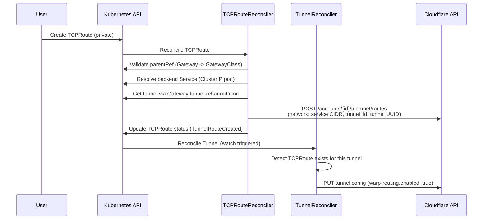
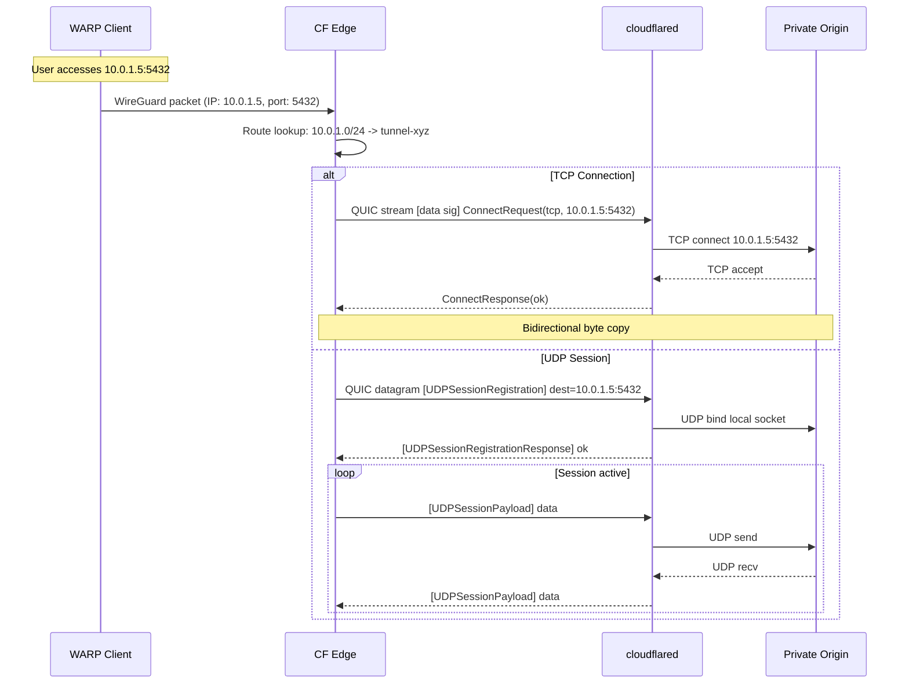

# cfgate v0.2.0 Roadmap

L4 routing, WARP private networks, and GRPCRoute support.

## Scope

v0.2.0 adds three new Gateway API route controllers (GRPCRoute, TCPRoute, UDPRoute), WARP routing for private network access, and tunnel route management for CIDR-to-tunnel mapping. All features operate within the Cloudflare Zero Trust free tier (50 users).

### In Scope

| Feature | Gateway API Resource | Cloudflare Mechanism |
|---------|---------------------|---------------------|
| gRPC routing | GRPCRoute (v1) | Ingress rules with h2c origin |
| TCP routing (public) | TCPRoute (v1alpha2) | Ingress rules with `tcp://` service URL |
| TCP routing (private) | TCPRoute (v1alpha2) | WARP routing + CIDR tunnel routes |
| UDP routing (private) | UDPRoute (v1alpha2) | WARP routing + CIDR tunnel routes |
| Private network CIDRs | N/A (operator-managed) | Tunnel Routes API |
| Virtual network isolation | N/A (operator-managed) | Virtual Networks API |

### Out of Scope

| Feature | Reason |
|---------|--------|
| Spectrum (L4 DDoS proxy) | Pro+ plan required; $1/GB overage |
| WARP client/split tunnel management | Device-level policy, not tunnel-level |
| Gateway DNS/HTTP policies | Separate concern; future scope |
| CloudflarePrivateNetwork CRD | Deferred to v0.3.0 for static CIDR management |

## Architecture Decisions

### ADR-1: WARP Routing Over Spectrum for L4

**Context:** The v0.1.0 TCPRoute/UDPRoute stubs reference Spectrum integration. Spectrum is an enterprise-only paid L4 proxy service.

**Decision:** Use WARP routing through tunnels for L4 traffic instead of Spectrum. WARP routing is free tier, handles TCP and UDP, and is already partially wired in cfgate (WarpRoutingConfig exists in client.go and configmap.go).

**Consequences:**
- L4 routing requires WARP client enrollment on connecting devices (not public internet-facing)
- cfgate manages tunnel routes (CIDR mappings) via the Cloudflare API
- Public TCP services still use ingress rules with `tcp://` service URLs and Access policies
- 50-user WARP limit on free tier; Teams Standard ($7/seat/month) for more

### ADR-2: Extend CloudflareTunnel CRD (Not New CRD)

**Context:** WARP routing configuration could live on the existing CloudflareTunnel CRD or a new CloudflarePrivateNetwork CRD.

**Decision:** Add `WarpRoutingSpec` to CloudflareTunnelSpec for v0.2.0. Defer CloudflarePrivateNetwork to v0.3.0.

**Consequences:**
- Minimal CRD surface area in v0.2.0 (already adding 3 controllers)
- CIDR routes created/deleted by TCPRoute/UDPRoute controllers, not the tunnel controller
- Tunnel controller enables `warp-routing.enabled` when any L4 route targets it
- v0.3.0 introduces the separate CRD for static routes and multi-tunnel mesh

### ADR-3: GRPCRoute Requires HTTP/2 Transport

**Context:** cloudflared's QUIC transport drops HTTP/2 trailers silently. gRPC encodes status codes in trailers. The HTTP/2 transport preserves trailers.

**Decision:** GRPCRoute controller auto-sets `h2cOrigin: true` on generated ingress rules and documents that `--protocol http2` may be required for gRPC reliability. Emit warning events about trailer/streaming limitations on QUIC transport.

**Consequences:**
- gRPC through Cloudflare Tunnel works reliably only with HTTP/2 transport
- cfgate should annotate or configure protocol selection per tunnel when GRPCRoute is attached
- Server streaming works; bidirectional streaming may have issues on QUIC
- This is a cloudflared architecture constraint, not fixable by cfgate

**Sources:**
- `cloudflared/connection/quic_connection.go:287-293` (trailer no-op on QUIC)
- `cloudflared/connection/http2.go:229-236` (trailer support on HTTP/2)
- [Cloudflare Road to gRPC](https://blog.cloudflare.com/road-to-grpc/)

### ADR-4: TCP Dual-Path (Public + Private)

**Context:** TCPRoute can route traffic two ways: public hostname ingress (with Access authentication) or private WARP routing (with CIDR routes).

**Decision:** Support both paths. Public TCP uses ingress rules with `tcp://` service URLs. Private TCP uses WARP routing with CIDR tunnel routes. The path is determined by whether the route has a `cfgate.io/hostname` annotation (public) or not (private, CIDR-based).

**Consequences:**
- Public TCP: DNS record + Access policy + ingress rule (similar to HTTPRoute)
- Private TCP: CIDR route + WARP routing enablement (no DNS, no Access)
- Annotation-driven routing decision keeps the Gateway API resource clean

## Controller Topology

```mermaid
graph TD
    subgraph "Gateway API Resources"
        GC[GatewayClass]
        GW[Gateway]
        HR[HTTPRoute]
        TR[TCPRoute v1alpha2]
        UR[UDPRoute v1alpha2]
        GR[GRPCRoute v1]
    end

    subgraph "cfgate CRDs"
        CT[CloudflareTunnel]
        CD[CloudflareDNS]
        CA[CloudflareAccessPolicy]
    end

    subgraph "Controllers"
        GCC[GatewayClassReconciler]
        GWC[GatewayReconciler]
        HRC[HTTPRouteReconciler]
        TRC["TCPRouteReconciler (new)"]
        URC["UDPRouteReconciler (new)"]
        GRC["GRPCRouteReconciler (new)"]
        CTC[CloudflareTunnelReconciler]
        CDC[CloudflareDNSReconciler]
        CAC[CloudflareAccessPolicyReconciler]
    end

    subgraph "Cloudflare API"
        TUN[Tunnel Config API]
        DNS[DNS API]
        ACC[Access API]
        RTE["Tunnel Routes API (new)"]
        VNT["Virtual Networks API (new)"]
    end

    GCC --> GC
    GWC --> GW
    GWC --> CT
    HRC --> HR
    TRC --> TR
    URC --> UR
    GRC --> GR

    CTC --> TUN
    CTC -.->|collects rules from| HR
    CTC -.->|collects rules from| GR
    CTC -.->|enables WARP routing if| TR
    CTC -.->|enables WARP routing if| UR

    TRC --> RTE
    URC --> RTE

    CDC --> DNS
    CAC --> ACC
```



## Data Flow: L4 Route Reconciliation



## WARP Routing Data Path



## Implementation Phases

### Phase 1: Foundation

Prerequisite for all new controllers. No user-facing changes.

| Task | Files | Description |
|------|-------|-------------|
| Client interface expansion | client.go, client_impl.go | Add TunnelRoute (5 methods) and VirtualNetwork (5 methods) groups |
| TunnelRouteService | cloudflare/tunnel_route.go (new) | EnsureRoute, DeleteRoute, ListRoutesForTunnel |
| Scheme registration | cmd/manager/main.go | `gwapiv1alpha2.Install(scheme)` |
| Gateway SupportedKinds | gateway_controller.go | Dynamic kinds based on listener protocol + feature gates |
| FeatureGates injection | gateway_controller.go | Pass FeatureGates to GatewayReconciler |

### Phase 2: GRPCRoute

Lowest risk; same ingress-rule mechanism as HTTPRoute. Validates the pattern before L4 work.

| Task | Files | Description |
|------|-------|-------------|
| GRPCRouteReconciler | grpcroute_controller.go (new) | Follow HTTPRoute pattern; auto-set h2cOrigin |
| Tunnel integration | cloudflaretunnel_controller.go | Extend collectIngressRules for GRPCRoute |
| Tunnel watches | cloudflaretunnel_controller.go | Add GRPCRoute watch + mapper |
| Feature gate registration | cmd/manager/main.go | Conditional GRPCRoute controller registration |

### Phase 3: TCPRoute + WARP Routing

Exercises the WARP routing path. Public hostname TCP uses ingress rules; private TCP uses CIDR routes.

| Task | Files | Description |
|------|-------|-------------|
| TCPRouteReconciler | tcproute_controller.go (rewrite) | Full implementation replacing stub |
| WARP routing toggle | cloudflaretunnel_controller.go, configmap.go | Enable warp-routing when L4 routes exist |
| Tunnel route lifecycle | tcproute_controller.go | Create/delete CIDR routes on reconcile |
| Feature gate registration | cmd/manager/main.go | Conditional TCPRoute controller registration |

### Phase 4: UDPRoute

Same pattern as TCPRoute private path. UDP-only (no public hostname without Spectrum).

| Task | Files | Description |
|------|-------|-------------|
| UDPRouteReconciler | udproute_controller.go (rewrite) | Full implementation replacing stub |
| Feature gate registration | cmd/manager/main.go | Conditional UDPRoute controller registration |

### Phase 5: Integration and Testing

| Task | Files | Description |
|------|-------|-------------|
| E2E: GRPCRoute | test/e2e/grpcroute_test.go (new) | gRPC routing tests |
| E2E: TCPRoute | test/e2e/tcproute_test.go (new) | TCP routing tests (public + private) |
| E2E: UDPRoute | test/e2e/udproute_test.go (new) | UDP routing tests (private only) |
| CRD validation | api/v1alpha1/cloudflaretunnel_types.go | CEL rules for WarpRoutingSpec |
| Documentation | docs/ | L4 routing guide, GRPCRoute guide, annotation updates |

## File Change Manifest

| File | Change | Phase |
|------|--------|-------|
| `cmd/manager/main.go` | Modify: add v1alpha2 scheme, conditional registration | 1 |
| `internal/cloudflare/client.go` | Modify: add TunnelRoute + VirtualNetwork types and methods | 1 |
| `internal/cloudflare/client_impl.go` | Modify: implement new Client methods | 1 |
| `internal/cloudflare/tunnel_route.go` | New: TunnelRouteService | 1 |
| `internal/controller/gateway_controller.go` | Modify: dynamic SupportedKinds, FeatureGates | 1 |
| `internal/controller/grpcroute_controller.go` | New: GRPCRouteReconciler | 2 |
| `internal/controller/cloudflaretunnel_controller.go` | Modify: extend collectIngressRules, add watches, WARP toggle | 2, 3 |
| `internal/cloudflared/configmap.go` | Modify: set WarpRouting.Enabled | 3 |
| `internal/controller/tcproute_controller.go` | Rewrite: full implementation | 3 |
| `internal/controller/udproute_controller.go` | Rewrite: full implementation | 4 |
| `internal/controller/annotations/annotations.go` | Modify: add virtual-network annotation | 3 |
| `internal/controller/status/conditions.go` | Modify: add TunnelRouteCreated condition | 3 |
| `api/v1alpha1/cloudflaretunnel_types.go` | Modify: add WarpRoutingSpec | 3 |
| `config/crd/bases/` | Auto-generated via codegen | 3 |
| `config/rbac/role.yaml` | Auto-generated via codegen | 2 |

## CRD Changes

### CloudflareTunnel: New WarpRoutingSpec

```yaml
apiVersion: cfgate.io/v1alpha1
kind: CloudflareTunnel
metadata:
  name: prod-tunnel
spec:
  # ... existing fields ...
  warpRouting:
    enabled: true
    virtualNetworkRef: "production"  # optional
```

Go types:

```go
type WarpRoutingSpec struct {
    // Enabled enables WARP routing for this tunnel. Automatically set
    // to true if any TCPRoute or UDPRoute targets this tunnel.
    // +kubebuilder:default=false
    Enabled bool `json:"enabled,omitempty"`

    // VirtualNetworkRef references a virtual network for overlapping CIDR
    // isolation. If unset, routes are assigned to the default virtual network.
    // +optional
    VirtualNetworkRef string `json:"virtualNetworkRef,omitempty"`
}
```

### New Client Interface Methods

```go
// Tunnel Route operations
ListTunnelRoutes(ctx context.Context, accountID string, params ListTunnelRoutesParams) ([]TunnelRoute, error)
GetTunnelRoute(ctx context.Context, accountID, routeID string) (*TunnelRoute, error)
CreateTunnelRoute(ctx context.Context, accountID string, params CreateTunnelRouteParams) (*TunnelRoute, error)
UpdateTunnelRoute(ctx context.Context, accountID, routeID string, params UpdateTunnelRouteParams) (*TunnelRoute, error)
DeleteTunnelRoute(ctx context.Context, accountID, routeID string) error

// Virtual Network operations
ListVirtualNetworks(ctx context.Context, accountID string) ([]VirtualNetwork, error)
GetVirtualNetwork(ctx context.Context, accountID, vnetID string) (*VirtualNetwork, error)
CreateVirtualNetwork(ctx context.Context, accountID string, params CreateVirtualNetworkParams) (*VirtualNetwork, error)
UpdateVirtualNetwork(ctx context.Context, accountID, vnetID string, params UpdateVirtualNetworkParams) (*VirtualNetwork, error)
DeleteVirtualNetwork(ctx context.Context, accountID, vnetID string) error
```

SDK mapping: Both are fully typed in cloudflare-go v6.6.0 (`NetworkRouteService`, `NetworkVirtualNetworkService`). No `WithJSONSet` workarounds needed for route CRUD. The `warp-routing.enabled` tunnel config field still requires `option.WithJSONSet()`.

## Constraints and Limitations

### Protocol Constraints

| Constraint | Impact | Mitigation |
|------------|--------|------------|
| QUIC transport drops HTTP/2 trailers | gRPC `grpc-status` lost | Force `--protocol http2` for GRPCRoute tunnels |
| UDP max datagram payload: 1280 bytes | Large UDP packets fragmented | Document; applications must handle MTU |
| `warp-routing.enabled` deprecated | Routes alone trigger traffic flow | Manage route lifecycle carefully |
| MaxActiveFlows limits concurrent sessions | Capacity planning needed | Expose as CloudflareTunnel spec field |

### Free Tier Constraints

| Constraint | Limit | Upgrade Path |
|------------|-------|-------------|
| WARP user enrollment | 50 seats | Teams Standard ($7/seat/month) |
| L4 public proxy (Spectrum) | Not available | Pro+ plan |
| Log retention | 24 hours | Teams Standard |
| Device posture checks | Basic only | Teams Standard |

### Testing Constraints

| Constraint | Impact | Mitigation |
|------------|--------|------------|
| WARP routing E2E requires enrolled WARP client | Cannot test in CI without WARP setup | Separate test suite or manual validation |
| GRPCRoute needs gRPC server in test cluster | Test infrastructure expansion | Deploy simple gRPC echo server |
| UDP testing needs WARP client | Same as WARP routing constraint | Manual validation initially |

## Risk Assessment

| Risk | Severity | Likelihood | Mitigation |
|------|----------|------------|------------|
| WARP routing requires client enrollment | Medium | Certain | Document; this is by design |
| gRPC trailer issues on QUIC | Medium | Known | Auto-detect and warn; recommend HTTP/2 transport |
| One-TCPRoute-per-listener enforcement | Low | Low | Validate in reconciler; status condition rejection |
| Virtual network lifecycle complexity | Low | Low | Deferred to v0.3.0 CRD |
| Enterprise features mixed with free tier | Medium | Medium | Clear documentation; runtime detection where possible |
| CIDR overlap rejection by API | Medium | Medium | Pre-validate in reconciler; surface as status condition |

## Milestones

| Milestone | Phase | Definition of Done |
|-----------|-------|-------------------|
| M1: Foundation | 1 | Client methods implemented, scheme registered, Gateway SupportedKinds dynamic |
| M2: GRPCRoute | 2 | GRPCRoute controller operational, ingress rules generated with h2c origin |
| M3: TCPRoute | 3 | TCPRoute controller operational, WARP routing toggles, CIDR routes created |
| M4: UDPRoute | 4 | UDPRoute controller operational |
| M5: Testing | 5 | E2E tests passing, CRD validation, documentation complete |
| M6: Release | N/A | v0.2.0 tagged, chart updated, release notes published |

## Sources

### Cloudflare Documentation
- [Connect a private network (CIDR)](https://developers.cloudflare.com/cloudflare-one/networks/connectors/cloudflare-tunnel/private-net/cloudflared/connect-cidr/)
- [WARP architecture](https://developers.cloudflare.com/cloudflare-one/team-and-resources/devices/warp/configure-warp/route-traffic/warp-architecture/)
- [Virtual networks](https://developers.cloudflare.com/cloudflare-one/networks/connectors/cloudflare-tunnel/private-net/cloudflared/tunnel-virtual-networks/)
- [gRPC connections](https://developers.cloudflare.com/network/grpc-connections/)
- [Tunnel configuration API](https://developers.cloudflare.com/api/resources/zero_trust/subresources/tunnels/subresources/cloudflared/)

### Cloudflare API
- [Create tunnel route](https://developers.cloudflare.com/api/resources/zero_trust/subresources/networks/subresources/routes/methods/create/)
- [List tunnel routes](https://developers.cloudflare.com/api/resources/zero_trust/subresources/networks/subresources/routes/methods/list/)
- [Create virtual network](https://developers.cloudflare.com/api/resources/zero_trust/subresources/networks/subresources/virtual_networks/methods/create/)

### Cloudflare Blog
- [Getting Cloudflare Tunnels to connect with QUIC](https://blog.cloudflare.com/getting-cloudflare-tunnels-to-connect-to-the-cloudflare-network-with-quic/)
- [Road to gRPC](https://blog.cloudflare.com/road-to-grpc/)
- [Build your own private network on Cloudflare](https://blog.cloudflare.com/build-your-own-private-network-on-cloudflare/)

### cloudflared Source (inherent-design fork)
- `connection/quic_connection.go:287-293`: QUIC transport trailer no-op
- `connection/http2.go:229-236`: HTTP/2 trailer support
- `tunnelrpc/proto/tunnelrpc.capnp`: Tunnel RPC schema (capnp)
- `config/configuration.go:265-269`: WarpRoutingConfig struct
- `quic/v3/datagram.go`: Datagram v3 binary protocol

### Gateway API
- [TCPRoute spec](https://gateway-api.sigs.k8s.io/reference/spec/#gateway.networking.k8s.io/v1alpha2.TCPRoute)
- [UDPRoute spec](https://gateway-api.sigs.k8s.io/reference/spec/#gateway.networking.k8s.io/v1alpha2.UDPRoute)
- [GRPCRoute spec](https://gateway-api.sigs.k8s.io/reference/spec/#gateway.networking.k8s.io/v1.GRPCRoute)
